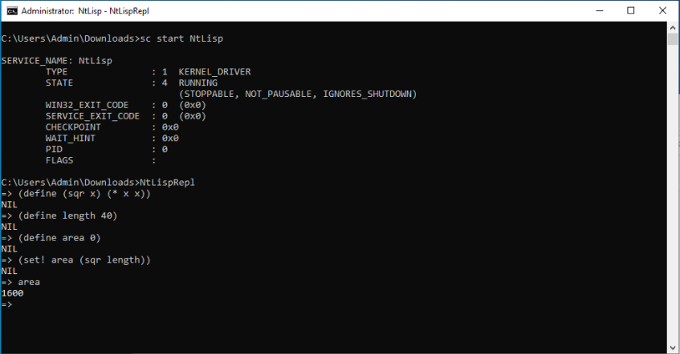

# NtLisp

Since [NtLua](https://github.com/can1357/NtLua) and [NtPhp](https://github.com/mrexodia/NtPhp) there has been an insatiable desire for more scripting languages in the kernel, so here is [lisp](https://github.com/justinmeiners/lisp-interpreter) in the kernel!

## 
